# Flutter Skill Showcase

A modern Flutter application demonstrating clean architecture principles, development best practices, and advanced Flutter techniques. This project serves as a practical example of scalable app structure, maintainable code organization, and modern development patterns.

---

## Screenshots

|                                              Authentication                                              |                                                Posts List                                                |                                                 Details                                                  |
| :------------------------------------------------------------------------------------------------------: | :------------------------------------------------------------------------------------------------------: | :------------------------------------------------------------------------------------------------------: |
|  |  |  |

## Purpose

This project demonstrates Flutter and mobile development skills, focusing primarily on:

- **Clean Architecture**: Clear separation between domain, presentation, and infrastructure layers
- **Best Practices**: Modern development patterns and code quality
- **Technical Expertise**: Proficiency with key Flutter libraries and tools

## Key Features

✅ **Clean Architecture**: Domain, Presentation, Infrastructure layers  
✅ **State Management**: Flutter BloC pattern  
✅ **Local Database**: Drift (SQLite) for data persistence  
✅ **API Integration**: Retrofit with Dio for networking  
✅ **Dependency Injection**: Get It + Injectable  
✅ **Navigation**: Go Router for declarative routing  
✅ **Secure Storage**: Flutter Secure Storage for sensitive data  
✅ **Authentication**: Complete system with JWT tokens  
✅ **Logging**: Customizable logging system per environment  
✅ **Multi-Environment**: Development and production configurations

## Technologies & Packages

### 🏗️ Architecture & Patterns

- **get_it** - Service locator for dependency injection
- **injectable** - Automatic DI configuration generation
- **bloc / flutter_bloc** - State management pattern
- **dartz** - Functional programming (Either, Option)

### 🌐 Networking & API

- **dio** - Advanced HTTP client
- **retrofit** - Automatic API client generation
- **pretty_dio_logger** - HTTP request logging

### 💾 Persistence & Storage

- **drift** - Modern SQLite ORM
- **drift_flutter** - Drift integration with Flutter
- **flutter_secure_storage** - Secure token storage
- **path_provider** - System directory access

### 🧭 Navigation & UI

- **go_router** - Declarative routing
- **nested** - Organized nested widgets
- **cupertino_icons** - iOS style icons

### 🔧 Serialization & Code Generation

- **json_serializable** - Automatic JSON serialization
- **freezed** - Immutable data classes
- **build_runner** - Code generation runner

### 📊 Utils & Reactive Programming

- **rxdart** - Reactive extensions for Dart
- **logger** - Configurable logging system

## 🏗️ Interactive Architecture Overview

Click on any component below to explore the codebase structure:

```mermaid
graph TB
    subgraph "📱 Presentation Layer"
        SignIn["🔐 Sign In Screen<br/>lib/src/presentation/screens/auth/signin/"]
        PostsList["📋 Posts List<br/>lib/src/presentation/screens/posts/posts_list_screen/"]
        Profile["👤 Profile Screen<br/>lib/src/presentation/screens/profile/"]
        AuthBloc["🎭 Auth BLoC<br/>lib/src/presentation/core/auth/bloc/"]
        PostsBloc["📝 Posts BLoC<br/>lib/src/presentation/screens/posts/posts_list_screen/bloc/"]
    end
    
    subgraph "🎯 Domain Layer"
        AuthDomain["🔐 Auth Domain<br/>lib/src/core/auth/src/domain/"]
        PostDomain["📝 Post Domain<br/>lib/src/core/post/src/domain/"]
        AuthService["🔧 Auth Service Interface<br/>lib/src/core/auth/src/domain/auth_service.dart"]
        PostsRepo["📚 Posts Repository Interface<br/>lib/src/core/post/src/domain/posts_repository.dart"]
    end
    
    subgraph "🔧 Infrastructure Layer"
        AuthInfra["🔐 Auth Infrastructure<br/>lib/src/core/auth/src/infrastructure/"]
        PostInfra["📝 Post Infrastructure<br/>lib/src/core/post/src/infrastructure/"]
        DriftDB["💾 Drift Database<br/>lib/src/core/post/src/infrastructure/datasources/local/"]
        ApiService["🌐 API Service<br/>lib/src/core/post/src/infrastructure/datasources/remote/"]
    end
    
    subgraph "⚙️ Configuration"
        ServiceLocator["🔗 Service Locator<br/>lib/src/config/service_locator/"]
        Router["🧭 App Router<br/>lib/src/config/router/"]
        Config["⚙️ Environment Config<br/>lib/src/config/config/"]
    end

    %% Interactions
    SignIn --> AuthBloc
    PostsList --> PostsBloc
    Profile --> AuthBloc
    
    AuthBloc --> AuthService
    PostsBloc --> PostsRepo
    
    AuthService --> AuthInfra
    PostsRepo --> PostInfra
    
    PostInfra --> DriftDB
    PostInfra --> ApiService
    
    AuthBloc --> ServiceLocator
    PostsBloc --> ServiceLocator
    AuthInfra --> ServiceLocator
    PostInfra --> ServiceLocator
    
    SignIn --> Router
    PostsList --> Router
    Profile --> Router

    %% Click events for navigation
    click SignIn "https://github.com/your-repo/tree/main/lib/src/presentation/screens/auth/signin" "Navigate to Sign In implementation"
    click PostsList "https://github.com/your-repo/tree/main/lib/src/presentation/screens/posts/posts_list_screen" "View Posts List implementation"
    click Profile "https://github.com/your-repo/tree/main/lib/src/presentation/screens/profile" "Explore Profile screen"
    click AuthBloc "https://github.com/your-repo/tree/main/lib/src/presentation/core/auth/bloc" "Check Auth BLoC state management"
    click PostsBloc "https://github.com/your-repo/tree/main/lib/src/presentation/screens/posts/posts_list_screen/bloc" "View Posts BLoC logic"
    click AuthDomain "https://github.com/your-repo/tree/main/lib/src/core/auth/src/domain" "Explore Auth domain models"
    click PostDomain "https://github.com/your-repo/tree/main/lib/src/core/post/src/domain" "View Post domain entities"
    click AuthInfra "https://github.com/your-repo/tree/main/lib/src/core/auth/src/infrastructure" "See Auth implementation details"
    click PostInfra "https://github.com/your-repo/tree/main/lib/src/core/post/src/infrastructure" "Check Post infrastructure"
    click DriftDB "https://github.com/your-repo/tree/main/lib/src/core/post/src/infrastructure/datasources/local" "View local database setup"
    click ApiService "https://github.com/your-repo/tree/main/lib/src/core/post/src/infrastructure/datasources/remote" "Explore API integration"
    click ServiceLocator "https://github.com/your-repo/tree/main/lib/src/config/service_locator" "See dependency injection setup"
    click Router "https://github.com/your-repo/tree/main/lib/src/config/router" "Check routing configuration"
    click Config "https://github.com/your-repo/tree/main/lib/src/config/config" "View app configuration"

    %% Styling
    classDef presentation fill:#e1f5fe,stroke:#01579b,stroke-width:2px,color:#000,cursor:pointer
    classDef domain fill:#e8f5e8,stroke:#2e7d32,stroke-width:2px,color:#000,cursor:pointer
    classDef infrastructure fill:#fff3e0,stroke:#ef6c00,stroke-width:2px,color:#000,cursor:pointer
    classDef config fill:#f3e5f5,stroke:#7b1fa2,stroke-width:2px,color:#000,cursor:pointer
    
    class SignIn,PostsList,Profile,AuthBloc,PostsBloc presentation
    class AuthDomain,PostDomain,AuthService,PostsRepo domain
    class AuthInfra,PostInfra,DriftDB,ApiService infrastructure
    class ServiceLocator,Router,Config config
```



### 📊 Data Flow Visualization


## Project Structure

```
lib/
├── main_dev.dart              # Development entry point
├── main_prod.dart             # Production entry point
└── src/
    ├── config/                # Global configurations
    │   ├── service_locator/   # Dependency injection
    │   ├── router/            # Route configuration
    │   └── extensions/        # Utility extensions
    ├── core/                  # Core features
    │   ├── auth/              # Authentication (Domain, Application, Infrastructure)
    │   ├── post/              # Posts (Domain, Application, Infrastructure)
    │   └── secure_storage/    # Secure storage
    └── presentation/          # Presentation layer
        ├── common/            # Common widgets
        ├── core/              # Core BLoCs
        ├── global/            # Global state
        └── screens/           # App screens
            ├── auth/          # Authentication screens
            ├── posts/         # Posts screens
            ├── profile/       # Profile screen
            └── splash/        # Splash screen
```

## Prerequisites

- **Flutter SDK**: >=3.4.4
- **Dart SDK**: >=3.4.4
- **Android Studio** / **VS Code** with Flutter plugins
- **Git** for version control

## Getting Started

### 1. Clone the repository

```bash
git clone [repository-url]
cd flutter_skill_showcase
```

### 2. Install dependencies

```bash
flutter pub get
```

### 3. Generate code

```bash
flutter packages pub run build_runner build --delete-conflicting-outputs
```

### 4. Environment setup

The project includes configurations for development and production:

- **Development**: `flutter run --flavor dev -t lib/main_dev.dart`
- **Production**: `flutter run --flavor prod -t lib/main_prod.dart`

## Usage

### Run the application

```bash
# Development mode
flutter run -t lib/main_dev.dart

# Production mode
flutter run -t lib/main_prod.dart
```

### Build for release

```bash
# Android
flutter build apk --flavor prod -t lib/main_prod.dart

# iOS
flutter build ios --flavor prod -t lib/main_prod.dart
```

### Run tests

```bash
flutter test
```

### Code Generation

When modifying models or services, regenerate code:

```bash
flutter packages pub run build_runner build --delete-conflicting-outputs
```

## Implemented Features

### 🔐 Authentication System

- Sign in with email and password
- Secure JWT token storage
- Auto-logout on token expiration
- Route guards for protected screens

### 📱 Posts Management

- Posts list with pagination
- Detailed post view
- Automatic API synchronization
- Local caching with Drift database
- Loading and error state handling

### 🏗️ Architecture

- Clear separation of concerns
- Configured dependency injection
- Centralized error handling
- Environment-based logging levels

## Contributing

If you'd like to contribute to the project:

1. Fork the repository
2. Create a new branch (`git checkout -b feature/new-feature`)
3. Commit your changes (`git commit -am 'Add new feature'`)
4. Push to the branch (`git push origin feature/new-feature`)
5. Open a Pull Request

### Code Standards

- Follow Dart/Flutter conventions
- Maintain test coverage > 80%
- Document public functions
- Use static analysis with `flutter analyze`

## License

This project is licensed under the MIT License - see the [LICENSE](LICENSE) file for details.

## Contact & Support

- **GitHub Issues**: For bug reports or feature requests
- **Email**: [your-email@domain.com]
- **LinkedIn**: [Your LinkedIn profile]

## Roadmap

### 🚧 Upcoming Features

- [ ] Complete offline mode
- [ ] Push notifications
- [ ] Dark/Light theme
- [ ] Internationalization (i18n)
- [ ] Integration tests
- [ ] CI/CD with GitHub Actions

### 🎯 Technical Improvements

- [ ] Performance monitoring
- [ ] Error tracking (Crashlytics)
- [ ] User analytics
- [ ] Bundle size optimization

---

⭐ If you found this project helpful, don't forget to give it a star!
